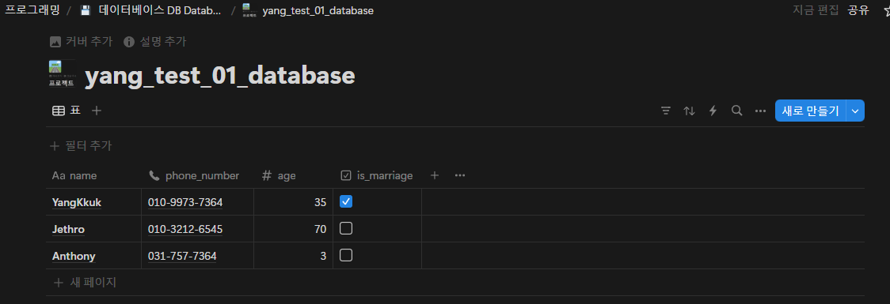

# Notion API 연동 (nlohmann/json, curl)

# 들어간 기능

- [json in C++](https://www.notion.so/json-in-C-19e45759635e80b884e7d2521c57646b?pvs=21)
- [프로젝트 속성(경로 매크로)](https://www.notion.so/19e45759635e8049ae22ecdbaa06099d?pvs=21)
- [CURL For Windows](https://www.notion.so/CURL-For-Windows-19e45759635e80fe8580f987129be8e0?pvs=21)

# 할꺼

- raw 데이터 보고 파싱하는거 코드 한번 보기 어떻게 파싱하는지.
- POST 데이터 입력하기.

# 코드 - GET



```cpp
Name: Anthony, Phone: 031-757-7364, Age: 3, Married: No
Name: Jethro, Phone: 010-3212-6545, Age: 70, Married: No
Name: YangKkuk, Phone: 010-9973-7364, Age: 35, Married: Yes
```
---
